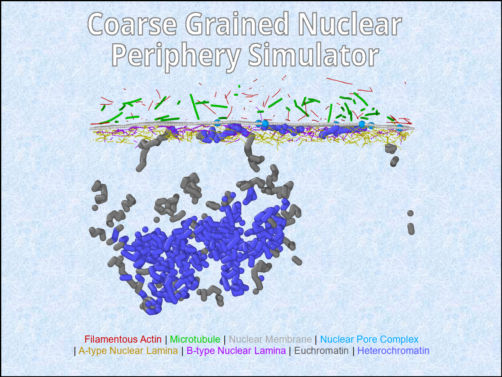

# CGNPS: Coarse-Grained Nuclear Periphery Simulator

CGNPS is a molecular dynamics simulation package for simulating a coarse-
grained model of the mammalian nuclear periphery. CGNPS is intended to enable a
researcher to study nuclear mechanotransduction in three steps: (1) assemble
the nuclear periphery structure with bioimaging and bioinformatics data, (2)
tune interaction parameters for calibration with biomechanical data, and (3)
build and run custom in silico experiments to study nuclear
mechanotransduction.



### Dependencies
1. LAMMPS \
Steve Plimpton, Fast Parallel Algorithms for Short-Range Molecular Dynamics,
J Comp Phys, 117, 1-19 (1995). https://doi.org/10.1006/jcph.1995.1039 \
Website: https://lammps.sandia.gov

2. Fluidmembrane Package \
Fu, S.-P., Peng, Z., Yuan, H., Kfoury, R., Young, Y.-N. (2016),
Lennard-Jones type pair-potential method for coarse-grained lipid bilayer
membrane simulations in LAMMPS, Mendeley Data, V1,
https://doi.org/10.17632/4v53nkv5hc.1 \
Website: https://doi.org/10.17632/4v53nkv5hc.1

3. NumPy for Python 2 and Python 3 \
Harris, C.R., Millman, K.J., van der Walt, S.J. et al. Array programming with
NumPy. Nature 585, 357–362 (2020). https://doi.org/10.1038/s41586-020-2649-2 \
Website: https://numpy.org

4. SciPy for Python 2 and Python 3 \
Virtanen, P., Gommers, R., Oliphant, T.E. et al. SciPy 1.0: fundamental
algorithms for scientific computing in Python. Nat Methods 17, 261–272 (2020)
https://doi.org/10.1038/s41592-019-0686-2 \
Website: https://scipy.org

5. Pizza.py Toolkit \
Website: https://lammps.github.io/pizza/

### Setup
1. Please refer to the website for installation instructions of the above 5
   dependencies.
2. The original pair_fluidmembrane.cpp in Fluidmembrane dependency will need a
   few modifications to make it compatible with the new LAMMPS versions. It is
   easy to do, but feel free to contact the Developer for the updated version.

### Usage
Step 0: Read the article at:

       [Link to article to be added here]

Step 1: Assemble the CGNP structure with bioimaging and bioinformatics data.

        The assembly module is used to generate and assemble the NP structure
        with experimental guidance. A new user would reproduce
        Fig. 1 in the article using this software module to get familiarity
        with the process. Then, the user can use their own bioimaging and
        bioinformatics data to assemble the NP structure for the specific
        mammalian nucleus being investigated.

Step 2a: Check calibration of fluctuation spectra of nuclear surface.

        The fluctuation module is used to generate fluctuation spectrum of
        nuclear surface for comparison with experimental nuclear surface
        fluctuations. A user would reproduce Fig. 2 in the article using this
        software module to check the calibration of nuclear surface
        fluctuations.

### Development

With following steps you can submit fixes for open issues or you can open a new
issue and submit fix for it:

```shell
# Fork this repository with the Fork button on top right
# Clone it to your local system
git clone https://github.com/<YourUserName>/CGNPS.git
# Make a new branch with issue number (e.g. 1) as branch name
git checkout -b 1
# Create a new remote for this upstream repo
git remote add upstream https://github.com/mechbio/CGNPS
# Make your changes
...
# Stage them and commit with the issue tag (i.e. #1 for issue number 1)
git add .
git commit -m "fixes #1"
# Push it back to your repo
git push -u origin 1
# Click the Compare & pull request button at github.com/<YourUserName>/CGNPS
# Click Create pull request to open a new pull request.
```

# Questions, Comments, Clarifications, Requests

Please use the Discussions tab. It'll be nice if you can introduce yourself to everyone in the Welcome thread.

### References
CGNPS improves and extends the CGNES package obtained from https://etda.libraries.psu.edu/catalog/26325pxs392.
